---
tags:
  - Typst
  - 工具
  - 排版
---

# Typst 的一些好用的包

[Typst](https://typst.app/) 是一门比较新的排版语言，编译快、语法干净，写笔记和讲义都很顺手。
但它内置的能力只覆盖「通用排版」这一层，画自动机、排伪代码、做幻灯片这些专门需求
得靠社区包（Universe）来补。

下面这些是我实际用过的。每个包都配了**一张渲染出来的效果图**和**一段能直接编译的最小源码**——
图不是截图，是用 `typst compile` 从源码真编出来的，源文件都在 `typst-demos/` 里，
改完跑一下 `scripts/render-typst-demos.ps1` 就能重新生成。

## 速查

| 包 | 干什么 |
| --- | --- |
| `finite` | 画有限自动机的状态转移图 |
| `syntree` | 画句法树 / 语法树 |
| `timeliney` | 画甘特图、时间线 |
| `gentle-clues` | 开箱即用的语义提示框 |
| `showybox` | 自由定制的彩色盒子 |
| `lovelace` | 伪代码（最轻） |
| `algorithmic` | 伪代码（仿 algorithmicx） |
| `algo` | 伪代码（结构最重） |
| `touying` | 做幻灯片 |
| `wrap-it` | 文字绕排图片 |
| `zebraw` | 带行号、语言标识的代码块 |
| `conch` | 渲染终端会话 |

---

## 画图

### finite · 画自动机

一句话概括：**给它一张状态转移表，它给你画出一张能直接放进讲义的状态图。**
起始状态、接受状态、转移边上的标签都能标，布局可以自动也可以手工给坐标。

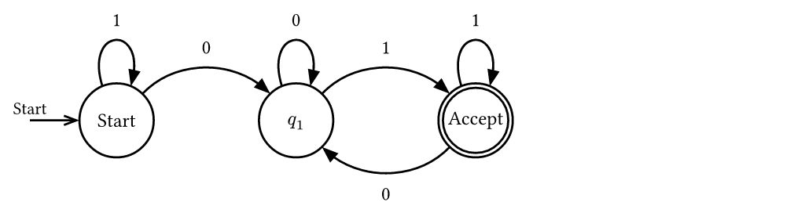
*一个接受「以 01 结尾的二进制串」的 DFA，由 `typst-demos/finite.typ` 编译得到*

写理论计算机科学的作业时特别省事——不用再拿 draw.io 手拖箭头，
状态一多也不会画歪，改一个转移只改一行代码。
底层用的是 `cetz`，所以画出来的线条质量不错。

??? example "源码"

    ```typst
    #set page(width: 13cm, height: auto, margin: 6pt, fill: white)
    #set text(font: ("Libertinus Serif", "Noto Sans SC"), size: 9pt)

    // finite 0.5.1：用状态转移表描述有限自动机，自动生成状态图。
    // 该 DFA 接受以 "01" 结尾的二进制串：q0 为起始状态，q1 与 q2 带自环。
    #import "@preview/finite:0.5.1": automaton

    #automaton(
      (
        q0: (q0: "1", q1: "0"),
        q1: (q1: "0", q2: "1"),
        q2: (q1: "0", q2: "1"),
      ),
      initial: "q0",
      final: "q2",
      labels: (q0: [Start], q1: [$q_1$], q2: [Accept]),
      layout: (q0: (0, 0), q1: (2.9, 0), q2: (5.8, 0)),
    )
    ```

### syntree · 画句法树

用**中括号嵌套**描述树的结构，第一层包一层，比手写坐标直观得多。
节点标签加 `^` 前缀会渲染成不带横线的三角形，这是语言学里画短语结构树的惯例画法。


*`The cat sat on the mat` 的短语结构树，由 `typst-demos/syntree.typ` 编译得到*

??? example "源码"

    ```typst
    #set page(width: 13cm, height: auto, margin: 6pt, fill: white)
    #set text(font: ("Libertinus Serif", "Noto Sans SC"), size: 9pt)

    // syntree 0.3.1：用中括号嵌套语法画短语结构树。
    // 第一个词是节点标签，其余内容是终端词；标签加 ^ 前缀表示无横线的三角形节点。
    #import "@preview/syntree:0.3.1": syntree

    #figure(
      gap: 0.5em,
      caption: [短语结构树示例],
      syntree(
        nonterminal: (style: "italic"),
        terminal: (fill: rgb("#1f4e79")),
        child-spacing: 1.2em,
        layer-spacing: 1.8em,
      )[
        [S
          [NP [Det The] [N cat]]
          [VP
            [V sat]
            [^PP on the mat]
          ]
        ]
      ],
    )
    ```

### timeliney · 画甘特图

日程表、项目排期用这个。`headerline` 定义时间刻度（可以分层，比如「年份 + 月份」），
`taskgroup` / `task` 排任务条，`milestone` 插里程碑。

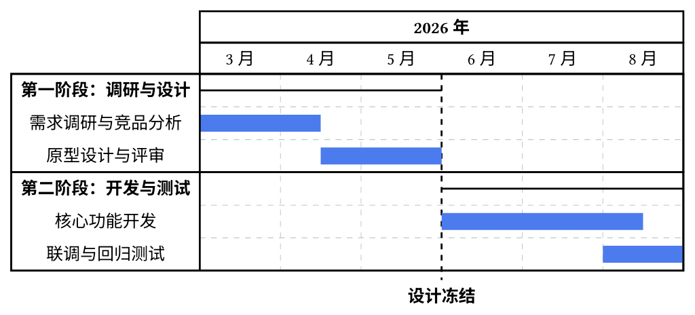
*一份 6 个月的项目排期，由 `typst-demos/timeliney.typ` 编译得到*

和用表格硬拼甘特图相比，好处是任务有先后依赖时不用手工对齐格子——
起止位置直接写数字，刻度改了整个图跟着重排。

??? example "源码"

    ```typst
    #set page(width: 13cm, height: auto, margin: 6pt, fill: white)
    #set text(font: ("Libertinus Serif", "Noto Sans SC"), size: 9pt)

    // timeliney 0.4.0：用 headerline 定义时间刻度，用 taskgroup / task 排布甘特条。
    // 下面是一条 6 个月（2026 年 3—8 月）的排期，任务名用中文。
    #import "@preview/timeliney:0.4.0"

    #timeliney.timeline(
      show-grid: true,
      grid-style: (stroke: (dash: "dashed", thickness: 0.4pt, paint: rgb("#c0c6cc"))),
      line-style: (stroke: 9pt + rgb("#4b7bec")),
      {
        import timeliney: *

        headerline(group(([*2026 年*], 6)))
        headerline(group(..range(3, 9).map(m => [#m 月])))

        taskgroup(title: [*第一阶段：调研与设计*], {
          task("需求调研与竞品分析", (0, 1.5))
          task("原型设计与评审", (1.5, 3))
        })

        taskgroup(title: [*第二阶段：开发与测试*], {
          task("核心功能开发", (3, 5.5))
          task("联调与回归测试", (5, 6))
        })

        milestone(
          at: 3,
          style: (stroke: (dash: "dashed")),
          align(center, [*设计冻结*]),
        )
      },
    )
    ```

---

## 提示框与盒子

这两个经常被拿来比，其实定位不一样：**gentle-clues 是语义化的提示框，showybox 是画盒子的原语。**

### gentle-clues · 开箱即用的提示框

写一句 `#info[...]`、`#warning[...]`、`#tip[...]` 就完事。
配色、图标、标题文案都是预设好的，标题还会跟着 `text(lang)` 自动切换语言——
所以只要写一行 `#set text(lang: "zh")`，出来的就是「信息 / 警告 / 提示」。

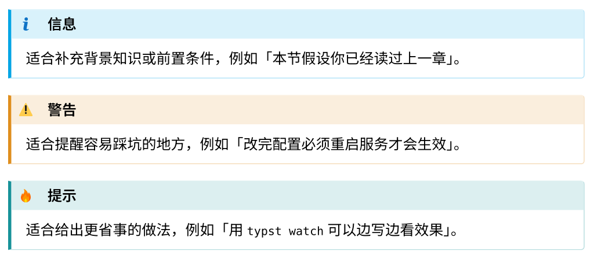
*三种最常用的提示框，由 `typst-demos/gentle-clues.typ` 编译得到*

它一共内置了十几种语义，覆盖得很全：

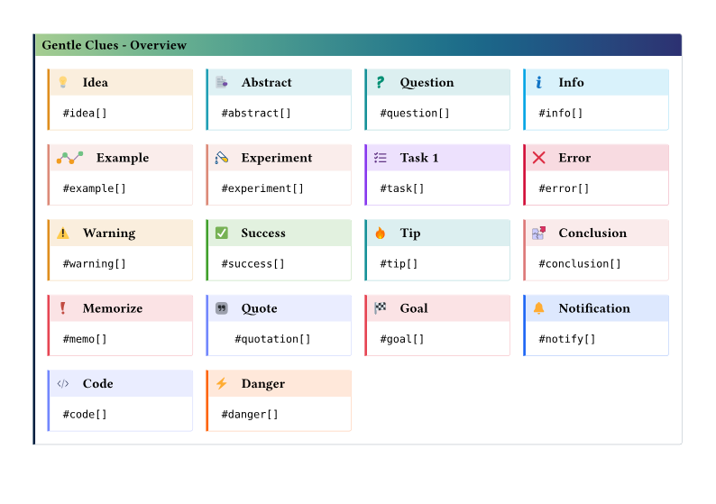
*内置的全部提示框类型*

适合「写作过程中随手标注」——想到要提醒读者一句，敲四个字符就完事，
不用停下来调样式。

??? example "源码"

    ```typst
    #set page(width: 13cm, height: auto, margin: 6pt, fill: white)
    #set text(font: ("Libertinus Serif", "Noto Sans SC"), size: 9pt)
    #set text(lang: "zh")

    #import "@preview/gentle-clues:1.3.1": info, warning, tip

    #info[适合补充背景知识或前置条件，例如「本节假设你已经读过上一章」。]

    #warning[适合提醒容易踩坑的地方，例如「改完配置必须重启服务才会生效」。]

    #tip[适合给出更省事的做法，例如「用 `typst watch` 可以边写边看效果」。]
    ```

### showybox · 自由定制的盒子

showybox 只提供「画盒子」这一件事：标题栏配色、正文底色、边框粗细、圆角、阴影
全部要自己指定。代码比 gentle-clues 长，换来的是完全可控。

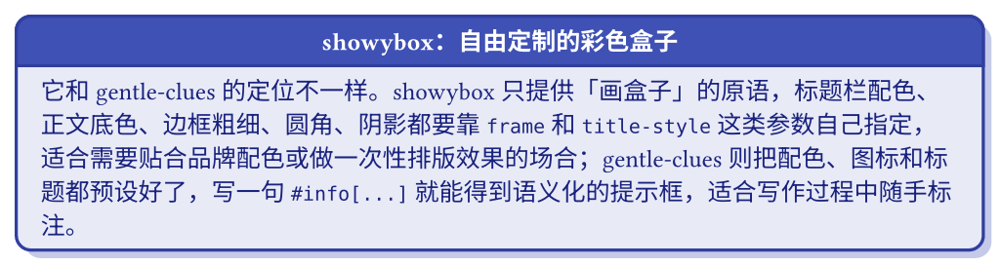
*一个自定义配色的盒子，由 `typst-demos/showybox.typ` 编译得到*

两者的取舍很清楚：

- 要**语义**（这是一条警告）→ 用 gentle-clues，少写代码，风格统一
- 要**外观**（就要这个颜色这个圆角）→ 用 showybox，贴合配色方案或做一次性排版效果

??? example "源码"

    ```typst
    #set page(width: 13cm, height: auto, margin: 6pt, fill: white)
    #set text(font: ("Libertinus Serif", "Noto Sans SC"), size: 9pt)
    #set text(lang: "zh")

    #import "@preview/showybox:2.0.4": showybox

    #showybox(
      title: "showybox：自由定制的彩色盒子",
      frame: (
        title-color: rgb(63, 81, 181),
        body-color: rgb(232, 234, 246),
        border-color: rgb(48, 63, 159),
        radius: 6pt,
        thickness: 1.2pt,
      ),
      title-style: (color: white, weight: "bold", align: center),
      body-style: (color: rgb(26, 35, 126)),
      shadow: (offset: 3pt, color: rgb(197, 202, 233)),
      [正文……],
    )
    ```

---

## 伪代码

Typst Universe 上写伪代码的包不止一个。我试了三个，差别主要在两处：
**语法有多重**，以及**默认排出来长什么样**。下面三段排的是同一个二分查找，
可以横向比较。

| 包 | 语法 | 默认排版 |
| --- | --- | --- |
| `lovelace` | **最轻**：就是一个普通列表，缩进即层级，不提供任何关键字或注释语法 | 素净，没有行号和参考线，关键字要自己加粗 |
| `algorithmic` | **最重**：`Procedure` / `While` / `IfElseChain` 这些结构化函数，参数是数组和代码块 | 最像论文，自动编号标题、行号、竖参考线、自动缩进 |
| `algo` | **中等**：内容块 + `\` 换行 + `#i` / `#d` 标记缩进 | 关键字自动加粗，版式紧凑，但缩进要自己标 |

### lovelace · 最不预设立场

它只做一件事：把列表渲染成伪代码的样子。没有 `while`/`if` 这种关键字函数，
也没有注释语法——**关键字就是你自己的 markup**，想让它们变粗就自己加粗。
代价是每行都要自己安排，好处是外观完全可控。

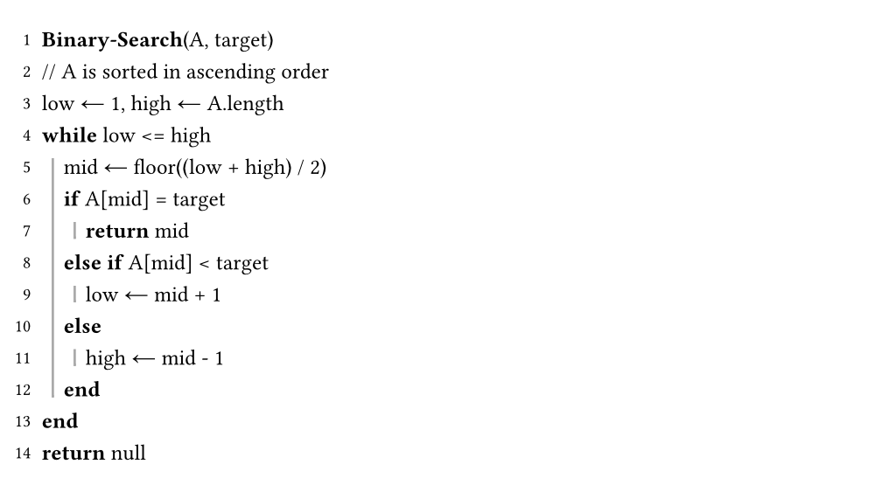
*同一段二分查找，由 `typst-demos/lovelace.typ` 编译得到*

!!! tip "注释要转义"

    注释在 lovelace 里没有专门语法，直接写就行。但在 Typst 的 markup 模式里
    `//` 是保留的，所以要写成 `\/\/`。

??? example "源码"

    ```typst
    #set page(width: 13cm, height: auto, margin: 6pt, fill: white)
    #set text(font: ("Libertinus Serif", "Noto Sans SC"), size: 9pt)

    #import "@preview/lovelace:0.3.1": pseudocode-list

    // Lovelace is unopinionated: there is no keyword or comment construct at all.
    // Every list item becomes one line, nesting becomes indentation, and keywords
    // are just markup you style yourself. "//" must be escaped in markup mode.
    #pseudocode-list[
      + *Binary-Search*(A, target)
      + \/\/ A is sorted in ascending order
      + low ← 1, high ← A.length
      + *while* low <= high
        + mid ← floor((low + high) / 2)
        + *if* A[mid] = target
          + *return* mid
        + *else if* A[mid] < target
          + low ← mid + 1
        + *else*
          + high ← mid - 1
        + *end*
      + *end*
      + *return* null
    ]
    ```

### algorithmic · 最像论文

模仿 LaTeX 的 `algorithmicx`。关键字、缩进、行号、竖参考线全都是自动的，
还会自动加上 `Algorithm 1: Binary Search` 这样的标题——投论文要的就是这个效果。

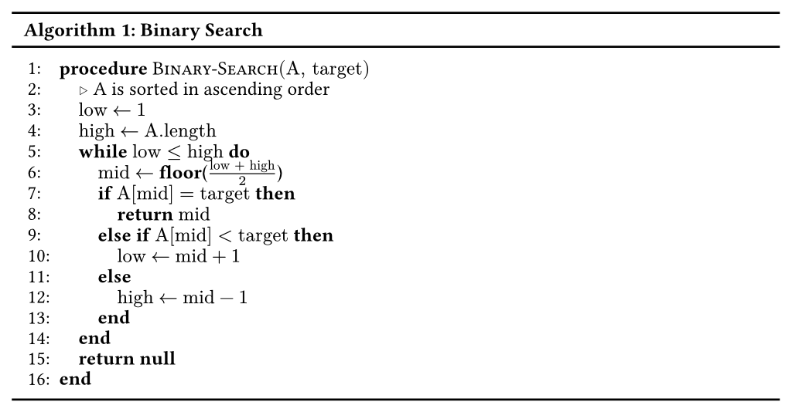
*同一段二分查找，由 `typst-demos/algorithmic.typ` 编译得到*

代价是**语法最啰嗦**：每个语句都是一个函数调用，条件、正文、分支要分别包在
数组和代码块里，嵌套一深括号就数不清了。适合「一次写对、之后很少改」的场合。

??? example "源码"

    ```typst
    #set page(width: 13cm, height: auto, margin: 6pt, fill: white)
    #set text(font: ("Libertinus Serif", "Noto Sans SC"), size: 9pt)

    #import "@preview/algorithmic:1.0.7"
    #import algorithmic: algorithm-figure, style-algorithm

    // The algorithmicx look: fixed `procedure`/`if ... then`/`while ... do`/`end`
    // keywords, auto indentation, a vertical guide stroke and line numbers.
    #show: style-algorithm

    #algorithm-figure("Binary Search", {
      import algorithmic: *
      Procedure("Binary-Search", ("A", "target"), {
        Comment[A is sorted in ascending order]
        Assign[$"low"$][$1$]
        Assign[$"high"$][$"A.length"$]
        While($"low" <= "high"$, {
          Assign($"mid"$, FnInline[floor][$("low" + "high") / 2$])
          IfElseChain(
            $"A"["mid"] = "target"$,
            { Return[$"mid"$] },
            $"A"["mid"] < "target"$,
            { Assign[$"low"$][$"mid" + 1$] },
            Assign[$"high"$][$"mid" - 1$],
          )
        })
        Return[*null*]
      })
    })
    ```

### algo · 折中

`algo` 把伪代码当成一个内容块来写：`\` 表示换行，`#i` / `#d` 表示进入和退出一层缩进，
关键字（`while`、`if`、`return`……）由包自动加粗。

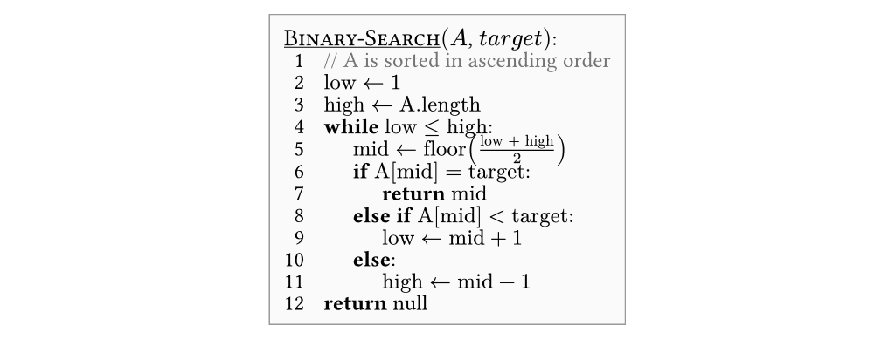
*同一段二分查找，由 `typst-demos/algo.typ` 编译得到*

源码读起来最接近伪代码本身，但缩进得自己数——`#i` 和 `#d` 要配对，
漏一个整段就歪了。

??? example "源码"

    ```typst
    #set page(width: 13cm, height: auto, margin: 6pt, fill: white)
    #set text(font: ("Libertinus Serif", "Noto Sans SC"), size: 9pt)

    #import "@preview/algo:0.3.6": algo, i, d, comment

    // Algo typesets a content block: "\" ends a line, #i/#d open and close an
    // indent level, keywords are auto-bolded, #comment puts a note on the line.
    #algo(
      title: "Binary-Search",
      parameters: ("A", "target"),
      inset: 6pt,
      row-gutter: 3pt,
      column-gutter: 8pt,
      indent-size: 12pt,
      stroke: 0.5pt + luma(60%),
    )[
      #comment(inline: true)[A is sorted in ascending order]\
      $"low" <- 1$\
      $"high" <- "A.length"$\
      while $"low" <= "high":#i\
        $"mid" <- "floor"(("low" + "high") / 2)$\
        if $"A"["mid"] = "target":#i\
          return $"mid"$#d\
        else if $"A"["mid"] < "target":#i\
          $"low" <- "mid" + 1$#d\
        else:#i\
          $"high" <- "mid" - 1$#d#d\
      return null
    ]
    ```

### 同一段算法的可见差别

把三张图放在一起看，差别集中在四处：

| | lovelace | algorithmic | algo |
| --- | --- | --- | --- |
| 外框与题注 | 无 | `Algorithm 1: Binary Search` | 浅灰圆角盒子 + `Binary-Search(A, target):` |
| 行号 / 缩进导引 | 只有行号 | 行号 + 竖参考线 | 无行号，靠缩进 |
| 注释 | 纯文本，`//` 要转义 | `▷` 符号 | 灰色 `//`，可挂行尾 |
| 数学 | 只能写 `<=`、`floor(...)` | 真正的 `≤`、分数 | 真正的 `≤`、分数 |
| 结束符 | 手写 `end` | 自动生成 | 靠 `#d` 关闭 |

### 怎么选

- 写论文、要 `Algorithm 1` 标题和行号 → **algorithmic**
- 想少写代码、只要一个能看的结果 → **algo**
- 想完全控制外观（不要行号、自定义关键字样式） → **lovelace**

---

## 幻灯片

### Touying · 做幻灯片

用写文档的方式写 slides：`==` 标题就是一页，版式交给主题统一管，
公式、代码高亮、`#alert[...]` 增量动画都是内置的，编出来是 16:9 的 PDF。

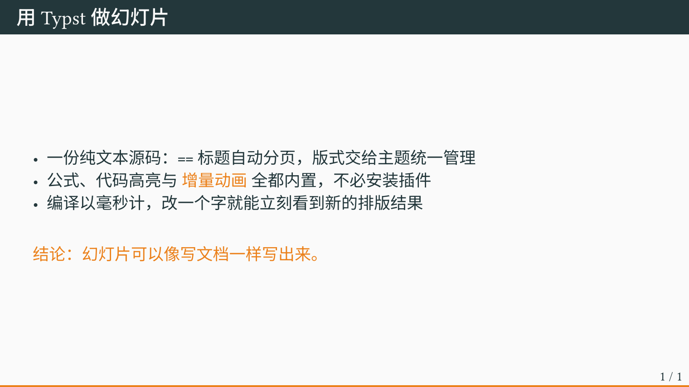
*metropolis 主题的一页内容页，由 `typst-demos/touying.typ` 编译得到*

Touying 是目前 Typst 生态里最成熟的幻灯片方案，自带主题不少，
也支持自定义主题。和 Beamer 比，语法简单得多；和 PowerPoint 比，
好处是整个 deck 是纯文本，能进 git、能 diff、能复用变量。

!!! warning "版本差异很大"

    Touying 0.8 和 0.6 的 API 不兼容，网上的教程大多还是老写法。
    以包内 README 为准：

    ```typst
    #import "@preview/touying:0.8.0": *
    #import themes.metropolis: *
    #show: metropolis-theme.with(aspect-ratio: "16-9")
    ```

    另外一级标题 `=` 会额外生成一张章节页，只想要内容页就用二级标题 `==`。

??? example "源码"

    ```typst
    #import "@preview/touying:0.8.0": *
    #import themes.metropolis: *

    #show: metropolis-theme.with(aspect-ratio: "16-9")

    #set text(font: ("Libertinus Serif", "Noto Sans SC"), lang: "zh")

    == 用 Typst 做幻灯片

    - 一份纯文本源码：`==` 标题自动分页，版式交给主题统一管理
    - 公式、代码高亮与 #alert[增量动画] 全都内置，不必安装插件
    - 编译以毫秒计，改一个字就能立刻看到新的排版结果

    #v(1.2em)

    #alert[结论：幻灯片可以像写文档一样写出来。]
    ```

---

## 排版细节

### wrap-it · 文字绕排图片

Typst 一直没有原生的图文绕排（文字沿着图片边缘流动），wrap-it 补上了这块。
原理是把图形和正文放进同一个网格，让正文在图形之外的列里换行。

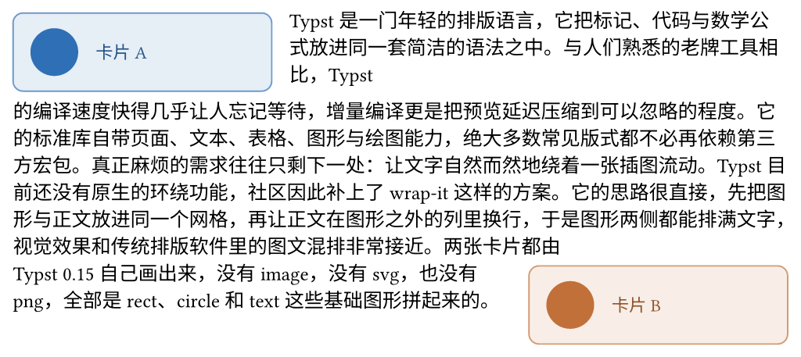
*两张卡片分别贴左、贴右，正文绕开它们排，由 `typst-demos/wrap-it.typ` 编译得到*

用法是 `wrap-top-bottom(顶部图形, 底部图形, 正文)`：上面那个图贴左边，
下面那个贴右边，正文先在第一张图右侧向下排，绕过之后回到整栏宽度，
再绕到第二张图的左侧继续。

!!! danger "wrap-it 对纯中文会静默失效"

    源码里切分正文用的是 `body.text.split(" ")`——**只认空格**。
    一整段中文如果只有寥寥几个空格，就等于只有几个「词」，
    内部算分割点时直接返回 0 或 -1，函数悄悄落到「不环绕」的分支：
    下面那张图不会环绕，而是孤零零掉到正文底下。不报错，只是效果没了。

    我这次就踩了：第一版渲染出来卡片 B 挂在页面最下方。
    解法是让段尾出现若干用空格分隔的拉丁词（`Typst 0.15`、`image`、`svg` 之类），
    尾部词粒度够细，分割点才落得下来。中英混排的文档天然没这个问题。

!!! note "文字不够长就看不到效果"

    如果正文比图形矮，环绕根本不会发生，图形下方的空白会把它和正文隔开。
    所以演示里的文字是故意写长的——那段说明本身不影响效果，只是为了让绕排看得见。

??? example "源码"

    ```typst
    #set page(width: 13cm, height: auto, margin: 6pt, fill: white)
    #set text(font: ("Libertinus Serif", "Noto Sans SC"), size: 9pt)

    #import "@preview/wrap-it:0.1.1": wrap-top-bottom

    // 被文字环绕的卡片完全由 Typst 绘制，不引用任何外部图片
    #let card(tag, tint) = box(
      width: 4.2cm,
      inset: (x: 8pt, y: 7pt),
      radius: 5pt,
      fill: tint.lighten(88%),
      stroke: 0.7pt + tint.lighten(30%),
      grid(
        columns: (auto, 1fr),
        column-gutter: 8pt,
        align: horizon,
        circle(radius: 11pt, fill: tint),
        text(size: 8pt, fill: tint.darken(25%))[#tag],
      ),
    )

    // 一段连续的中文正文
    #let passage = [
      Typst 是一门年轻的排版语言，它把标记、代码与数学公式放进同一套简洁的语法之中。……
      两张卡片都由 Typst 0.15 自己画出来，没有 image，没有 svg，也没有 png，
      全部是 rect、circle 和 text 这些基础图形拼起来的。
    ]

    // 上卡片靠左、下卡片靠右，文字从两张卡片中间穿过
    #wrap-top-bottom(
      card([卡片 A], rgb("#2f6fb5")),
      card([卡片 B], rgb("#c2703a")),
      passage,
      top-kwargs: (column-gutter: 0.9em),
      bottom-kwargs: (column-gutter: 0.9em),
    )
    ```

### zebraw · 带行号和语言标识的代码块

Typst 原生的 `raw` 代码块没有行号、没有语言标签，也不能高亮某几行。
zebraw 就是来补这些的。

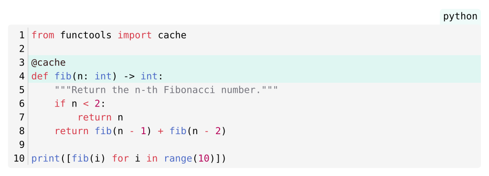
*行号 + 右上角语言标识 + 第 3、4 行高亮，由 `typst-demos/zebraw.typ` 编译得到*

三个开关都在这段里：

```typst
#v(1.4em)                       // 给语言标签留出上边距，见下面的坑

#zebraw(
  lang: true,                    // 右上角显示语言名
  numbering-separator: true,     // 行号和代码之间加一条竖线
  highlight-lines: (3, 4),       // 高亮指定行
  code,                          // 注意 body 是最后一个参数，位置传参即可
)
```

!!! warning "语言标签画在代码块上边缘之外"

    源码里用 `v(-measure(lang-tab).height)` 把标签往上挪，所以它会跑到代码块的
    边界以外。页面边距小的时候（比如 6pt）会被直接裁掉半个字。
    在 `#zebraw()` 前面加一段 `#v(1.4em)` 就好。

包里有中文文档（`README_zh.md`，20 KB），参数说明比英文版还全。

??? example "源码"

    ```typst
    #set page(width: 13cm, height: auto, margin: 6pt, fill: white)
    #set text(font: ("Libertinus Serif", "Noto Sans SC"), size: 9pt)

    #import "@preview/zebraw:0.6.3": zebraw

    #let code = ```python
    from functools import cache

    @cache
    def fib(n: int) -> int:
        """Return the n-th Fibonacci number."""
        if n < 2:
            return n
        return fib(n - 1) + fib(n - 2)

    print([fib(i) for i in range(10)])
    ```

    // 语言标签绘制在代码块上边缘之上，留出这一段空白避免被页面裁掉
    #v(1.4em)

    #zebraw(
      lang: true,
      numbering-separator: true,
      highlight-lines: (3, 4),
      code,
    )
    ```

---

## 终端

### conch · 把终端会话写成代码

conch 解决的是「怎么在文档里放一段终端输出」这件事。
传统做法是截图，缺点很明显：改一个字就要重新截，图片还不能进 git diff。

conch 让你直接写命令，它在一个虚拟文件系统里**真的执行**，然后把带配色和语法高亮的
终端窗口渲染出来。改哪条命令就改哪一行代码，重新编译即可。

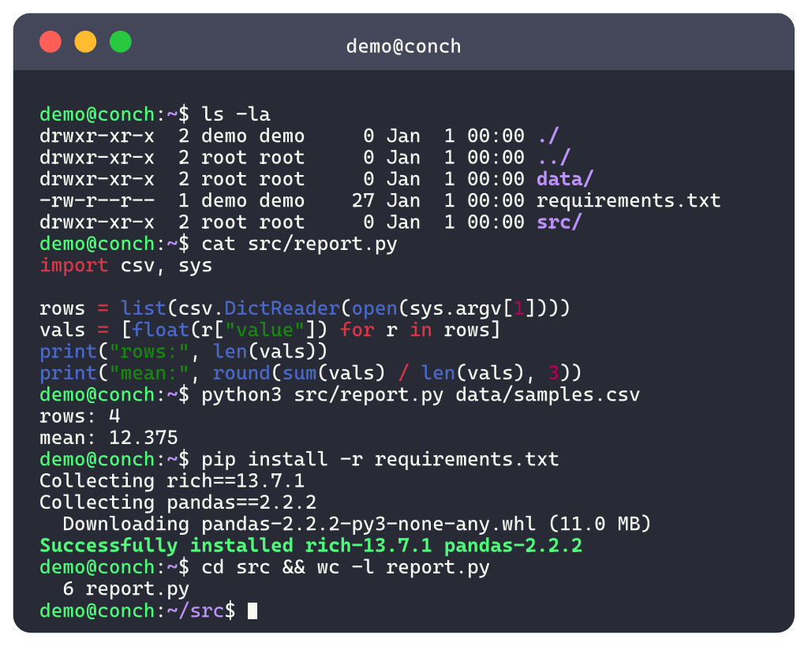
*一段完整的会话：列目录、看脚本、跑脚本、装依赖，由 `typst-demos/conch.typ` 编译得到*

演示里的几个细节值得一提：

- `python3 src/report.py data/samples.csv` 输出的 `mean: 12.375`，
  是照着虚拟文件系统里 `data/samples.csv` 的内容现算出来的，不是写死的字符串
- `pip install -r requirements.txt` 里的 `Collecting rich==13.7.1`
  来自虚拟的 `requirements.txt`
- 最后一条 `cd src` 之后，提示符从 `demo@conch:~$` 变成了 `demo@conch:~/src$`

也就是说这段「终端画面」和真实运行是自洽的。内置命令表之外的工具，
可以用 Typst 函数注册插件补上（上面两个就是这么做的）。

!!! warning "终端正文里每一行都会被当成命令"

    所以画面内只能写英文——写中文会报 `command not found`。
    中文说明放在源码注释里。

??? example "源码"

    ```typst
    #import "@preview/conch:0.1.0": system, terminal-block

    #let python3(args, stdin, files) = {
      let script = args.at(0, default: "")
      let data = if args.len() > 1 { files.at(args.at(1), default: "") } else { "" }
      if script not in files or data == "" {
        return (
          stdout: "python3: can't open file '" + script + "': [Errno 2] No such file or directory\n",
          exit-code: 2,
        )
      }
      let s = stats(data)
      (stdout: "rows: " + str(s.n) + "\nmean: " + str(s.mean) + "\n", exit-code: 0)
    }

    #terminal-block(
      system: system(
        hostname: "conch",
        files: (
          "requirements.txt": requirements,
          "data/samples.csv": samples,
          "src/report.py": report-py,
        ),
        plugins: (("python3", python3), ("pip", pip)),
      ),
      user: "demo",
      theme: "dracula",
      font: (font: ("Cascadia Mono", "DejaVu Sans Mono"), size: 9pt),
      width: 100%,
    )[```
    ls -la
    cat src/report.py
    python3 src/report.py data/samples.csv
    pip install -r requirements.txt
    cd src && wc -l report.py
    ```]
    ```

---

## 这些示例怎么跑

所有示例都是独立可编译的，放在仓库的 `typst-demos/` 下。全部重新渲染：

```powershell
pwsh -File scripts/render-typst-demos.ps1
```

脚本会逐个 `typst compile --format png --ppi 200`，输出到 `docs/assets/typst/`，
本页引用的就是那些图。首次运行会自动从 Typst Universe 下载用到的包。

加一个新包的演示：在 `typst-demos/` 里新建一个 `.typ`，跑脚本，再在本页加一段。
